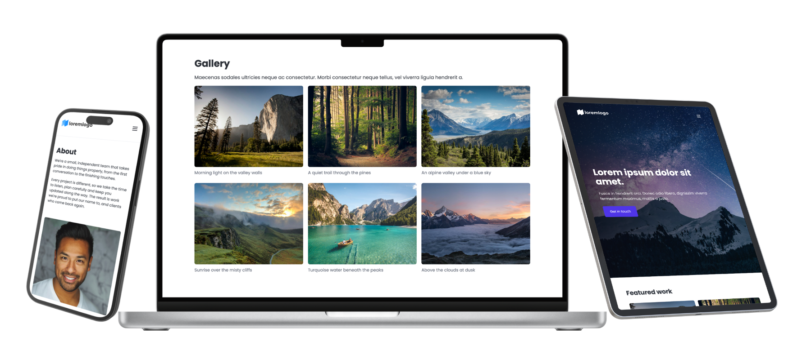

# smol-cms


[](LICENSE)

A very smol CMS template: public site plus a password-protected `/admin`, where
one editor fills in a few forms and uploads images from their phone. Built to be
cloned as the starting point for small business sites.



## Features

- **Stack:** Hono on a single Netlify Function, server-rendered JSX, htmx in the
  admin, Pico CSS, no frontend build
- **Content:** sections and fields defined in JSON; admin forms and validation
  are generated from it
- **Storage:** Netlify Blobs, with separate content for previews and production
- **Images:** Cloudinary; photos are resized on the device and uploaded
  directly, with drag and drop, progress and retry
- **Admin:** mobile-first, single password with change and reset, unsaved
  change protection
- **Site:** responsive layout, lightbox gallery, Netlify Forms contact form,
  inferred SEO tags, sitemap and robots

## Build and run

Requires Node 24 (see `.nvmrc`), the Netlify CLI (`npm i -g netlify-cli`) and
a free Cloudinary account for uploads.

```bash
git clone https://github.com/blakesimpson-dev/smol-cms.git
cd smol-cms
npm install
cp .env.example .env        # admin password, session secret, Cloudinary keys
npm run dev                 # http://localhost:8888, admin at /admin
```

To deploy, create a Netlify site from the repo, set the variables from
`.env.example`, and enable **Forms → form detection**.

To start a new site from the template, clone it into a new repo and keep this
one as a remote (`git remote rename origin template`), so updates can be pulled
with `git pull template main`. Site-specific content lives in `src/content/`.

## Scripts

| Script                            | Purpose                                  |
| --------------------------------- | ---------------------------------------- |
| `npm run dev`                     | Netlify dev server on :8888              |
| `npm run preview`                 | Production build served on :8899         |
| `npm run build`                   | Full Netlify build, locally              |
| `npm test`                        | Unit tests (`node:test`)                 |
| `npm run lint` / `typecheck`      | ESLint (Google TypeScript style) / `tsc` |
| `npm run format` / `format:check` | Prettier                                 |

A forgotten admin password is reset by deleting the stored one, so
`ADMIN_PASSWORD` applies again: `netlify blobs:delete content admin-auth`.

## Licence

The code is MIT, see [LICENSE](LICENSE). Bundled third-party files keep their
own licences: htmx (Zero-Clause BSD), Pico CSS (MIT), the Poppins font (SIL Open
Font License) and the default photos (Unsplash License).
